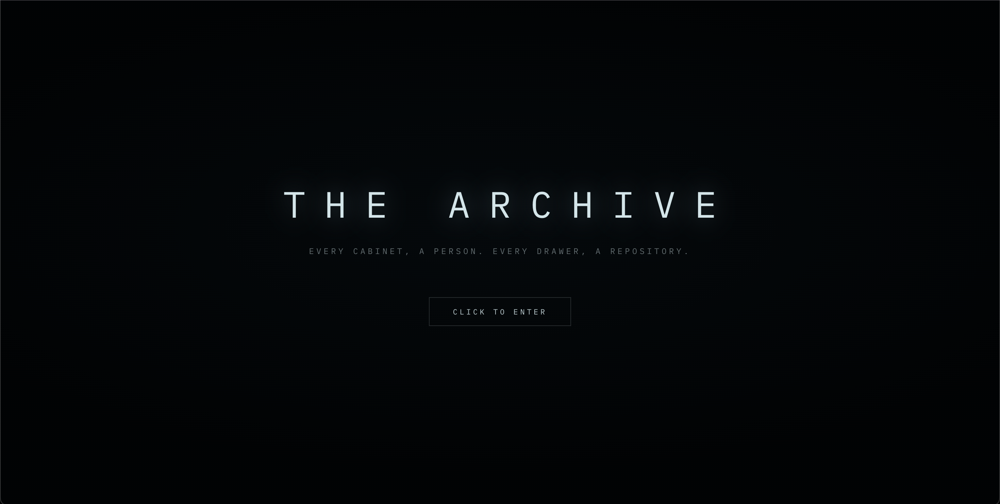
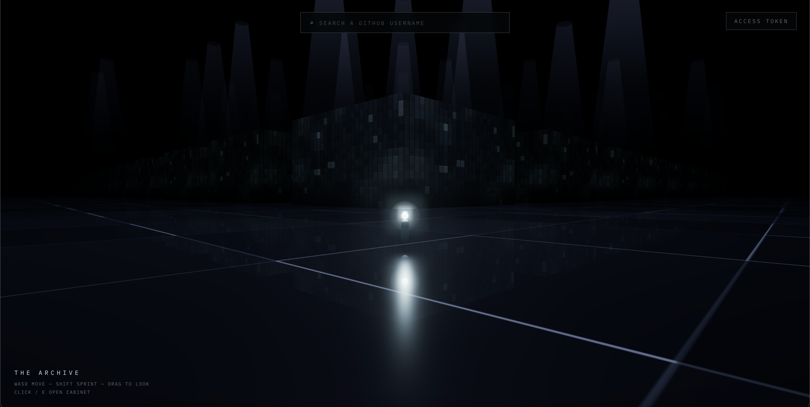

# The Archive

> Every cabinet, a person. Every drawer, a repository.

The Archive turns GitHub into a place you can walk through. Every account is a filing cabinet standing in a dark, endless hall. Open one and its repositories are the drawers inside. Type a username and you fly across the room to their cabinet.

It runs entirely in the browser. No install, no build step — open the page and start walking.

**Live:** https://the-archive-mazens-projects-de6b4d2d.vercel.app





## What it does

- Search any GitHub username and travel to their cabinet.
- A cabinet's drawers are that person's repos. Open one to see its stars, language, description, and a link straight to GitHub.
- The cabinets around you are filled with real, well-known accounts so the hall is never empty — a different set each time you load.
- Optional: paste a personal access token to raise the GitHub rate limit from 60 to 5,000 requests an hour. It's stored in your browser and nowhere else.

## Controls

WASD to move, Shift to sprint, drag the mouse to look around. Walk up to a cabinet and click it (or press E) to open it.

## How it's built

No framework and no bundler. It's plain ES modules and Three.js loaded straight from a CDN.

- **Three.js** for the scene — instanced cabinets so a whole field renders cheaply, a reflective floor, exponential fog, and a bloom + film-grain pass over the top.
- The world is **infinite**: cabinets stream in and out around you as you move, so you can keep walking in any direction.
- **GitHub data** comes from the REST API, fetched lazily and cached in `localStorage` so it doesn't burn through the rate limit on every visit.
- The little **settings panel** (fog, bloom, light color, camera distance, walk speed) is a small React component compiled in the browser with Babel standalone.

The code lives under `js/`:

| File | What it handles |
|------|-----------------|
| `world.js` | scene, fog, reflective floor, post-processing |
| `cabinets.js` | the streaming cabinet field and drawer textures |
| `player.js` | movement, the figure, travel-to-cabinet flights |
| `github.js` | the GitHub API layer + caching |
| `ui.js` | the overlay: intro, search, nameplate, drawer browser |
| `fixtures.js` | the etched nameplate and the sliding drawer |
| `config.js` | shared constants and the event bus |

## Running it locally

Because it uses ES modules, serve the folder instead of opening the file directly:

```bash
python3 -m http.server
```

Then visit http://localhost:8000.

## Deploying

It's a static site, so any host that serves files works. This one is deployed on Vercel — push to `main` and it redeploys on its own.

---

WebGL is required, so use a desktop browser with hardware acceleration.
